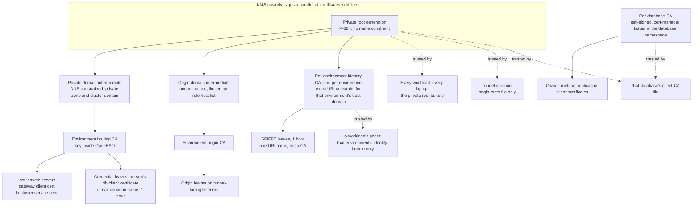

# Trust and access: every certificate family and every access path

This directory is the single place that describes **who trusts whom, and
why**: every private PKI, every family of certificate, and every path by
which one machine reaches another or a person reaches a machine -- including
the parts that are not OpenBAO (cert-manager, Envoy Gateway, Cloudflare, the
database operator, the SSH daemon, the tailnet).

The rest of `docs/` documents mechanism, one library or chart at a time.
This directory documents the **shape they are used in**: the model, the
rules, and the reasons, with the alternatives that were rejected. Where a
mechanism is already described elsewhere it is linked, not repeated.

| Page | What it answers |
|---|---|
| this page | the rule, the decision table "I need X to talk to Y", the trust-anchor map |
| [hierarchy.md](hierarchy.md) | the root, the intermediates, the ceremonies, rotation and retirement |
| [issuance.md](issuance.md) | cert-manager, approver-policy, trust-manager: who may ask, who decides, who distributes trust |
| [servers-and-edge.md](servers-and-edge.md) | server names, Envoy Gateway, Cloudflare, how trust flows edge, origin, service |
| [workload-identity.md](workload-identity.md) | SPIFFE identity for workloads: what it is for, what it is not, the peer rules |
| [databases.md](databases.md) | PostgreSQL: server, applications, replication, people, the plan and its phases |
| [people.md](people.md) | sign-in, token exchange, `accessctl`, SSH (a CA and opkssh), network reach |
| [decisions.md](decisions.md) | the decision log: choice, alternatives with pros and cons, consequences |
| [status.md](status.md) | the living page: what is LIVE, IN PROGRESS, PLANNED, and a dated change list |

**Status words.** Every page marks what is not yet delivered as **PLANNED**
(decided, not built) or **IN PROGRESS** (partly built). Anything unmarked is
LIVE in the shape described. [status.md](status.md) is the one table to check
before relying on a sentence elsewhere. Statements that could not be
confirmed are marked **to be confirmed**; they are collected on the status
page.

## The rule: a certificate family is decided by what the name is

Every certificate in the estate answers the question "what is being named?".
The answer picks the family, and the family fixes the issuer, the trust
anchor, the lifetime and the person or system that may ask.

| The name is... | Family | Issued by | Trusted through | Lives |
|---|---|---|---|---|
| **a host** (a DNS name we own, including a Service's in-cluster name) | the **private hostname chain** | an environment issuing CA in OpenBAO, through a cert-manager `ClusterIssuer` | the private root, distributed to every namespace | 30 days (90 at most) |
| **a workload** (a Kubernetes ServiceAccount) | the **per-environment SPIFFE identity CA** | that environment's root-signed identity CA in OpenBAO, through the CSI driver | that environment's identity bundle, and nothing else | 1 hour |
| **a person** (an e-mail) | an OpenBAO **credential role** (`db-client`, common name is the e-mail) for databases; the **SSH CA** or **opkssh** for SSH | OpenBAO, on the person's own sign-in; opkssh needs no CA at all | the server that accepts it (a database's client-CA file; `sshd`) | 1 hour (database); the issuer session (SSH, at most 24 hours) |
| **a database's own clients** (its owner, its runtime roles, its replicas) | **that database's own CA** | a cert-manager `Issuer` in the database's namespace | that database alone | as cert-manager renews |
| **the public** (a browser) | Cloudflare's edge certificates | Cloudflare | the browser's own store | Cloudflare's |
| **the tunnel's origin** (what the tunnel daemon connects to) | the **origin chain**, a second domain intermediate | an environment origin CA in OpenBAO | the tunnel daemon only, from a pinned file | 30 days (90 at most) |

**The bootstrap exception.** cert-manager needs something to sign with
before OpenBAO exists, and a database needs a self-signed anchor of its own
(below). A **self-signed** `Issuer` or CA `Issuer` in one namespace is
therefore allowed: it confers no trust outside that namespace, because
whoever can create it already holds its key. It is never used for anything
another namespace must trust, and it is never backed by OpenBAO.

**Why families instead of one CA for everything.** Each family answers a
different question. A host certificate says "you reached the machine you
meant to reach", and is checked against a *name*. A workload certificate says
"the thing on the other end is this ServiceAccount", and is checked against
an *identity*. A person's certificate says "this human signed in a few
minutes ago", and is checked against a *mapping* the server owns. A database
client certificate says "the holder has this database's own key". One CA
issuing all four would need one policy able to express all four -- and the
first mistake in it would let a certificate of one meaning be accepted as
another. Separate chains make the confusion structurally impossible: a
workload chain *cannot* mint a hostname, because its CA carries a URI
constraint and no DNS one.

## I need X to talk to Y: which mechanism

| I need... | Use | Read |
|---|---|---|
| a server to present a certificate for its name (an HTTPS service, a broker, a database, OpenBAO itself) | a cert-manager `Certificate` from the `ClusterIssuer` for the private chain; clients **verify the name** against the private root | [issuance](issuance.md), [servers-and-edge](servers-and-edge.md) |
| a browser to reach a console or an application | the edge terminates TLS; the gateway signs the person in through the access issuer | [servers-and-edge](servers-and-edge.md#sign-in-at-the-gateway) |
| the tunnel daemon to reach the gateway | an origin-chain leaf on the listener; the daemon verifies it against a pinned root file | [servers-and-edge](servers-and-edge.md#trust-flows-edge-then-origin-then-service) |
| one workload to call another in the same cluster | the baseline: default-deny NetworkPolicy plus server TLS on the callee. **SPIFFE identity** only where it pays (below) | [workload-identity](workload-identity.md) |
| a workload to call another across clusters, a broker, or a sensitive service | a SPIFFE identity leaf on both sides, an allow-list of ServiceAccounts | [workload-identity](workload-identity.md) |
| an application to reach its PostgreSQL | verify the server with the private root; authenticate with a client certificate from **that database's own CA** | [databases](databases.md) |
| a migration job to change a schema | the database's owner certificate, from the same per-database CA | [databases](databases.md#applications-owner-migrations-runtime) |
| a database replica to stream | the replication certificate from the per-database CA | [databases](databases.md#the-per-database-ca) |
| a person to open a SQL session | `accessctl psql`: an OpenBAO `db-client` certificate, e-mail common name, mapped to a role | [databases](databases.md#people), [people](people.md) |
| a third-party tool that cannot present a client certificate to a database | an explicit **password** role, off by default | [databases](databases.md#the-password-fallback) |
| a person to log in to a host | **opkssh** (no CA) or the SSH user CA, over the tailnet | [people](people.md#ssh) |
| a machine (a CI job, a controller) to log in to a host | an OpenBAO-signed SSH user certificate, with a forced command where the account is restricted | [people](people.md#ssh) |
| a client to trust a host it SSHes to | a host certificate from the SSH host CA, one `@cert-authority` line on the client | [people](people.md#ssh) |
| a person to use Kubernetes, AWS, or OpenBAO's own API | `accessctl kube-token`, `accessctl aws`, `accessctl bao`: a token exchange, nothing stored | [people](people.md#accessctl) |
| a controller to read a secret | a projected ServiceAccount token, an OpenBAO JWT login, no stored credential | [issuance](issuance.md#how-issuers-log-in) |
| a certificate for a name the private chain must not sign (the tunnel origin) | the **origin chain**, whose roles are limited to an explicit host list | [hierarchy](hierarchy.md#the-domain-intermediates) |

## The trust-anchor map

Read arrows as "signs" and dashed arrows as "is trusted by". Everything in
the top block is one KMS-held root and the chains that hang from it; the
per-database CAs at the bottom are deliberately **outside** it.

Who trusts which anchor, and why that anchor and not a broader one:

| Relying party | Trusts | Why not more |
|---|---|---|
| any client verifying a server by name | the private root (every trusted generation) | the server sends its whole chain, so the root alone is enough; the name constraint on the intermediate already limits what the chain can name |
| the tunnel daemon | the origin roots file, nothing else | only the tunnel reaches origin listeners; a browser never sees the origin chain, so nothing else needs to trust it |
| a workload verifying a peer's identity | its own environment's identity CA | a bundle holding another environment's CA would accept that environment's identities; the CA's exact URI constraint would still forbid minting them, but a verifier should not need to lean on that |
| a database verifying its own clients | its own CA, plus the private root **only** when people connect | see below: the root is a wide anchor, so it is added only for the one population that needs it |
| `sshd` for people | the access issuer's signing keys (opkssh), fetched live | no CA is involved; there is nothing to distribute or revoke |
| `sshd` for machines | the environment's SSH user CA public key | machines have no interactive browser flow |
| an SSH client verifying a host | the environment's SSH **host** CA public key, one `@cert-authority` line | a separate key from the user CA: trusting a key for hosts must never also mean trusting it for users |

### Why PostgreSQL needs a self-signed anchor, and what follows

libpq builds on OpenSSL. OpenSSL accepts a trust anchor only when it is a
**self-signed** certificate; an intermediate placed alone in the trust file
does not anchor a chain. So a PostgreSQL server that must verify client
certificates (`ssl_ca_file`), and a client that must verify the server
(`sslrootcert`), both need the **root**, not an intermediate.

The consequence is the reason the per-database CA exists: **any server that
trusts the private root as a client-certificate anchor accepts every
certificate under it.** The root's name constraints are on the intermediates
and are checked for names, not for "is this certificate one this database
should admit". There is no environment binding and no namespace binding by
chain alone. If an application database trusted the private root, anything
another namespace could get an issuer to sign with the right common name
would authenticate. The decision is therefore:

- **servers** are verified against the private root (that is what the root is
  for, and server names are checked as names);
- a database's **own clients** are authenticated by a CA that database owns,
  self-signed, in its own namespace -- the chain itself binds the certificate
  to that namespace and that environment;
- the private root is added to a database's client-CA file **only** to admit
  people (who arrive with an OpenBAO-issued certificate), and then a tested
  invariant guards it: *nothing under the private root may issue a bare
  common name that is neither a hostname nor an e-mail address*
  ([databases.md](databases.md#the-invariant-that-guards-the-root-anchor)).

## Reading order

New to the platform shape: this page, then [hierarchy.md](hierarchy.md),
[issuance.md](issuance.md), then the pages for the paths you use. Adopting
only part of it: the workload-identity and database pages assume the pages
before them (the hierarchy and issuance), and nothing else assumes them;
[adoption.md](../adoption.md) covers adopting a hierarchy that already exists.

Mechanism pages this directory builds on, and does not repeat:
[ceremony.md](../ceremony.md), [custody.md](../custody.md),
[pki.md](../pki.md), [approver.md](../approver.md), [model.md](../model.md),
[builder.md](../builder.md), [server.md](../server.md), [integrations/access-roster.md](../integrations/access-roster.md),
and the design records in [decisions/](../decisions/README.md).

## Contributing: a trust path change updates this directory

**Any pull request that changes a trust path must update `docs/trust/` in the
same pull request.** A trust path is any of: a certificate family or its
issuer; a CA, its constraints, lifetime or algorithm; a trust bundle's
sources or its distribution; an approver policy; who may ask for a
certificate; a hostname rule; an access path for a person or a machine (SSH,
database, cluster, cloud, gateway sign-in); a rotation or reload rule.

Concretely, in the same pull request:

1. edit the page that describes the path;
2. add or supersede an entry in [decisions.md](decisions.md) if a choice
   changed (never rewrite an old entry to reverse it; supersede it);
3. move the capability in [status.md](status.md) and add a dated line under
   "Changes".

A reviewer should refuse a trust-path change that leaves this directory
saying something the code no longer does. Undelivered work stays marked
PLANNED until the pull request that delivers it merges.
