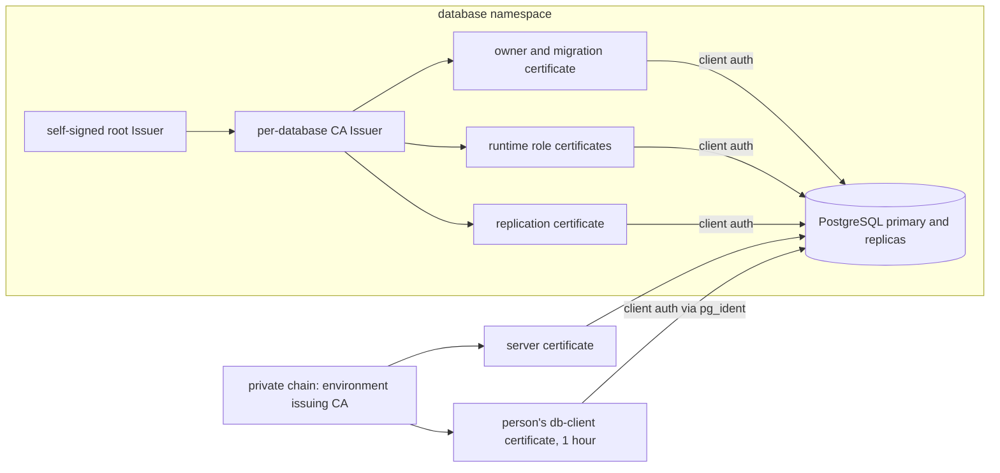
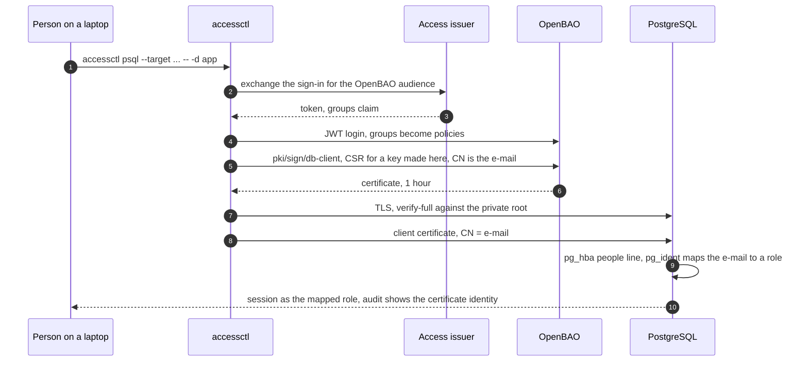

# PostgreSQL: server identity, application clients, replication and people

PostgreSQL is run by the CloudNativePG operator (chart:
[truvity/cnpg-cluster](https://github.com/truvity/cnpg-cluster)). This page is
the decided plan for how every party proves who it is to a database and how the
database proves who it is to them. **Most of it is PLANNED** (decided, not
built); each section says which. The status of each phase is in
[status.md](status.md).

## Summary

| Party | Proves itself with | Verified against | Family |
|---|---|---|---|
| the **server** | a certificate for `<cluster>-rw` (and `-ro`, `-r`) `.<namespace>.svc.<cluster-domain>` | the **private root**, by every client, `verify-full` | private hostname chain |
| an **application's owner and migration** role | a client certificate, CN = the role | the **database's own CA** | per-database CA |
| an application's **runtime** roles | a client certificate, CN = the role | the database's own CA | per-database CA |
| **replication** (`streaming_replica`) | a client certificate, CN = `streaming_replica` | the database's own CA | per-database CA |
| a **person** | an OpenBAO `db-client` certificate, CN = their e-mail, mapped to a role | the private root **plus** the database's own CA in the client-CA file | credential role |
| a **third-party tool** that cannot present a client certificate | a password, on an explicit role | SCRAM | fallback |

**Two rules hold through the whole page.** *A client always verifies the server
by name* (`verify-full`). *No database trusts a broad anchor for its own
applications*: an application's client certificate must chain to a CA that
belongs to that database alone.



## The server

The server certificate comes from the **private chain** (role `service`), with
subject alternative names for the operator's three Services:
`<cluster>-rw.<namespace>.svc.<cluster-domain>`, `-ro`, and `-r`. The server's
own CA Secret carries the private roots (every trusted generation).

- **Clients verify with `verify-full`** against the private root bundle, which is
  already delivered to every namespace ([issuance.md](issuance.md#trust-bundles)).
  The server sends leaf and intermediates, so the root alone suffices (a Java
  client with PKIX; libpq as well, because the root is self-signed).
- **Clients dial the fully qualified name.** The certificate names only the
  `svc.<cluster-domain>` forms, by policy: the short `.svc` forms are absent and
  denied. A client configured with `<cluster>-rw` fails `verify-full`. Move the
  client's host and its `sslrootcert` first, then flip the mode.
- **Rotation.** The Secret carries the CloudNativePG `cnpg.io/reload: "true"` label
  (a rule for every user-provided Secret, see
  [issuance.md](issuance.md#reloading-what-actually-picks-up-a-renewed-file)) so the
  operator reloads a renewed server certificate. Proven in a development
  environment: a forced renewal was served within 10 seconds with no instance
  restart.
- `sslmode=require` (encrypt, verify nothing) is not acceptable as a steady state:
  it accepts any certificate. Rollback of a `verify-full` step is one connection
  string, with no database-side change.

**Status: IN PROGRESS.** The server certificate from the private chain is live,
and the chart labels its server-TLS and server-CA Secrets for reload. `verify-full`
is being adopted client by client: an identity server using the Java PostgreSQL
driver is on it in development and production (its own ServiceAccount, the
fully qualified host, the private root mounted as a directory); the url-shortener
example chart in truvity/policy gains an off-by-default
`database.tls.mode: require|verify-full` with the same shape. Others are to be
confirmed per consumer.

## Why the database's own clients get their own CA

The client-CA file (`ssl_ca_file`) decides which client certificates are
accepted. Three candidates were considered ([Decisions](#decisions-and-rejected-alternatives)
has the full comparison).

1. **The operator's default CA.** CloudNativePG creates a self-signed per-cluster
   CA and signs replication and `DatabaseRole` certificates from it. It works and
   needs nothing, but the operator owns issuance: it produces SEC1 keys that a Java
   client cannot read, and it is a *second* CA outside cert-manager's policy and
   observability.
2. **An OpenBAO-backed `ClusterIssuer`** for application certificates (the
   private chain). Rejected. libpq needs a self-signed anchor
   ([README](README.md#why-postgresql-needs-a-self-signed-anchor-and-what-follows)),
   so trusting the private root as a client anchor admits **every** certificate
   under it: nothing in the chain binds the certificate to this database's
   namespace or environment. A `ClusterIssuer` lets any namespace that can ask
   mint `CN=<role>`. It would also need a new OpenBAO role shape (a bare CN), a new
   approver policy shape, and would put an environment-wide CA in the database's
   trust file.
3. **A CA that belongs to the database.** *Chosen.* A cert-manager **namespaced**
   self-signed `Issuer`, and a CA `Issuer` from it, in the database's namespace.
   The chain itself binds a certificate to that namespace and that environment:
   only the namespace's holders can make the issuer. No new OpenBAO role, no
   `ClusterIssuer`, and no new approver policy (the namespaced-issuer policy
   already covers it).

## The per-database CA

**PLANNED.** Per database:

1. A self-signed root `Issuer` and a CA `Issuer` (both namespaced, in the database's
   namespace), plus the CA certificate.
2. CloudNativePG is told to use it:

   ```yaml
   spec:
     certificates:
       serverTLSSecret: <cluster>-server-tls      # private chain leaf
       serverCASecret:  <cluster>-server-ca       # the private roots
       clientCASecret:  <cluster>-client-ca       # ca.crt ONLY, no ca.key
       replicationTLSSecret: <cluster>-replication # a cert-manager leaf, CN streaming_replica
   ```

   `clientCASecret` holds **`ca.crt` and no `ca.key`**: CloudNativePG documents that
   with a supplied `replicationTLSSecret` the key can be omitted, and the operator
   must not hold the CA key -- cert-manager owns it. The webhook requires a
   `clientCASecret` whenever a `replicationTLSSecret` is provided.
3. The **replication** certificate is a cert-manager Certificate from the
   per-database CA with common name `streaming_replica`, so the operator's fixed
   `hostssl replication ... cert map=cnpg_streaming_replica` rules and its fixed
   `pg_ident` mapping keep working unchanged.
4. **Consequence: the operator can no longer mint `DatabaseRole` client
   certificates for this cluster** (it does not hold the CA key). Application and
   owner certificates are cert-manager Certificates instead. Do not try to keep
   both by copying the operator's CA key into the client-CA secret: the operator
   would then not own a CA secret it does not renew, and the rotation burden moves
   to us, in a form nobody designed. (This variant was considered and rejected.)
5. **Reload:** label the client-CA and replication Secrets `cnpg.io/reload: "true"`
   (and the server TLS and server CA Secrets: every user-provided Secret).

**Phase 0 spike results** (small local cluster: cert-manager 1.21, trust-manager
0.25, CloudNativePG operator 1.30 with chart 0.29, PostgreSQL 18). All GO except
the open point in the last item:

- A `clientCASecret` **without `ca.key`** plus a user-supplied
  `replicationTLSSecret` (CN `streaming_replica`) from a per-database
  cert-manager CA is accepted, and replication is healthy.
- Role certificates from the per-database CA are accepted; a certificate with the
  same CN from another CA is refused (`unknown ca`).
- The client-CA file must hold the **intermediate(s) as well as the root**,
  because a client sends only its leaf.
- CN-only leaves (an e-mail as CN, or a bare CN, and no SAN) verify under a
  DNS-name-constrained intermediate; a DNS SAN outside the constraint fails, as
  intended.
- The people path works: a `pg_hba` people line before the catch-all plus
  `pg_ident` e-mail-to-role rows; an unmapped e-mail is refused; a person's
  certificate cannot take an application role.
- **Open design point (phase 2).** trust-manager can target a Secret and set its
  labels (so `cnpg.io/reload` can be set), but a `Bundle`'s sources must live in
  the trust namespace. A per-database CA Secret in the database's namespace
  therefore cannot be a source; how the client-CA file gets the private root
  beside it is to be designed.

Replacing a live cluster's client CA rolls its instances and rotates the
replication certificate. Do it on a small cluster first, and only when the cluster
is Ready and archiving cleanly; a client-CA change during a WAL-archive problem
makes it worse.

## Applications: owner, migrations, runtime

| Role | Purpose | Certificate |
|---|---|---|
| **owner** | the only DDL-capable identity; runs migrations; never interactive | a cert-manager Certificate from the per-database CA, CN = the owner's role name |
| **runtime roles** | the application's day-to-day access; not DDL-capable | one Certificate per role, CN = the role name |

For now some consumers use the owner as their runtime role too; splitting them
is a per-application follow-up, not a prerequisite.

- **Common name = the role name.** PostgreSQL's `cert` method compares the client
  certificate's **CN** with the requested database user (or, with a map, whatever
  the map allows). A subject alternative name -- a URI, a DNS name -- is **never
  read**. So these certificates have `subject.commonName` set and client-auth
  usage only, and the per-database CA has no other job.
- **Keys** ECDSA, **PKCS#8** where a Java client reads them, `rotationPolicy:
  Always`, mounted as a directory.
- **Order matters for migrations.** A migration is usually a pre-install hook of the
  application release. A hook may only name things that are *also hooks* or that
  exist before it runs; a hook that mounts a Secret created by an ordinary resource
  of the same release fails on the *pod*, never created, with the reason in an event
  nobody is watching, while the install sits at "in progress" until it times out.
  So **the owner certificate is issued by the infrastructure release** (the one that
  creates the database and the per-database CA), before the application release
  and its migration hook run. A release that creates its own database can never
  migrate it.
- **`pg_hba` ordering** (first match wins; there is no fall-through): the owner and
  application roles use `hostssl ... cert`, then the people line (below), then the
  operator's own appended catch-all. Anything the platform adds *after* the
  catch-all is unreachable, so extra lines must be rendered before it.

## People

A person connects with `accessctl psql` (or `accessctl pg -- <command>`): it signs
in, logs in to OpenBAO, and asks the `db-client` credential role to sign a CSR for
a P-384 key **generated on the laptop**; the private key never crosses the wire.
The certificate's CN is the person's e-mail (the role accepts only the caller's own
alias name, validated as an e-mail), it lives one hour, and the role offers `sign`
only and stores nothing. The command then runs with libpq's environment set:
`PGSSLMODE=verify-full`, the certificate and key, and `PGSSLROOTCERT`.



What the server needs (**PLANNED**; only the client half exists today):

1. **The private root in `ssl_ca_file`.** The database's client-CA file holds the
   per-database CA **and** the private root. (That is why `clientCASecret` is
   built from both certificates, without a key.) This is the one place the wide
   anchor is admitted, and it is guarded by the
   [invariant](#the-invariant-that-guards-the-root-anchor).
2. **A people line before the catch-all**: `hostssl` for the people-facing roles,
   method `cert`, `map=people`. The exact user and database fields of the line are to
   be confirmed when it is implemented.
3. **`pg_ident` rows: explicit, e-mail to role, per environment.** One row per
   person-to-role mapping, rendered from the same access configuration that
   grants the person the `db-client` group in the first place. The mapping is
   **explicit**, never a pattern: a person is admitted to a database role because a
   row says so, and the ladder (the roles people may map to) is the existing one
   minus superuser. **Role names must not start with `pg_`**: that prefix is
   reserved in PostgreSQL, so the ladder's final names are to be decided
   ([T-25](decisions.md#t-25-people-ladder-roles-avoid-the-reserved-pg_-prefix)).
4. **Roles that exist for people**, e.g. an administrative role (owner membership)
   and a read-only auditor role. Project viewers and deployers get no database
   access by default.

**`accessctl` needs two more flags (PLANNED):**

- `--as <role>`: the role to connect as. Today `PGUSER` defaults to the certificate
  CN (the e-mail), which is not a role name; with a map it must be the *role*.
- `--target <address>`: dial an address while verifying a name (libpq `hostaddr`), for
  in-cluster names that do not resolve from a laptop
  ([people.md](people.md#network-reach)). The root CA default should be the private
  root, not the certificate's own chain.

Until they ship, the same result is `PGUSER=<role> ... host=<fqdn>
hostaddr=<ip>` set by hand.

**No local database proxy.** A design where `accessctl` runs a loopback proxy that
holds the certificate and forwards to the database was considered and rejected
([T-15](decisions.md#t-15-no-local-database-proxy)): libpq already does everything the
proxy would, `hostaddr` covers reach, and a proxy is a long-running local process
with a listening socket and a second TLS termination.

### The invariant that guards the root anchor

Because the private root is in the client-CA file, **any certificate under it
whose CN equals a database role name would authenticate at the catch-all line.**
The design therefore keeps this **tested invariant**:

> **No issuer under the private root issues a certificate whose common name is
> neither a hostname nor an e-mail address.**

Today it holds by the *shape* of the roles: the host and service roles issue
hostnames (`enforce_hostnames`), the credential role validates an e-mail, and the
identity role issues no common name at all. E-mail CNs have no row that maps them
except explicit people rows; hostname CNs are not role names. The **test** that pins
this over every role in the contract is **PLANNED** (its natural home is
`pkg/pki`'s `Validate`); until it exists, this is the review item on every new role
under the private root. **Any change that lets an issuer under the root sign an
arbitrary CN breaks every database that trusts the root for people.**

An unavoidable corollary: a namespace holder who can create the per-database CA
`Issuer` holds its key, and could mint `CN=<person's e-mail>`; they already hold the
database's owner authority by holding the CA key. This is accepted -- it is the
"whoever can create the issuer already holds its key" property, not a widening.

## Per-driver rotation notes

Client certificates rotate. What "rotate" costs depends on the driver.

| Client | Behaviour | What to do |
|---|---|---|
| **libpq / psycopg** | reads the certificate and key files when it connects | mount as a directory; new connections pick up the new files |
| **Go, pgx** | the config is parsed once; a connection pool reuses the parsed TLS config | set `BeforeConnect` (`ConnConfig.BeforeConnect`, or `OptionBeforeConnect` on the stdlib wrapper) to **re-parse** the config -- and so re-read the files -- for each new connection |
| **Go, a shared library that caches a connector** | a connector built once holds the certificate it read at construction | rebuild it, or move to a config-callback per connection; a cached connector works until the first certificate expires and then fails all at once |
| **a server whose DSN is read from a file** (the `DSN_FILE` pattern) | a rotating driver re-reads the file per new connection | no application code change |
| **Java, pgjdbc** | `sslcert`, `sslkey`, `sslrootcert` in the URL; the SSL factory is built per new connection and reads the files then (source reading; **to be confirmed by test**) | the key must be **DER PKCS#8**. Tested with 42.7.7 and 42.7.11: the driver cannot read a PEM PKCS#8 EC key (cert-manager's PEM output); DER PKCS#8 works. Convert with `openssl pkcs8 -topk8 -nocrypt -outform DER` (`openssl pkey -outform DER` emits SEC1 and fails). Candidate without a conversion step: cert-manager `additionalOutputFormats: DER` (**to be verified**). Mounted Secret volume, never `subPath` |

In all cases an **established** connection keeps its old session: PostgreSQL
checks the certificate only at the handshake. Rotation therefore takes effect at
the next reconnect, and a long-lived pool is bounded by its max-lifetime setting.
Verify with `pg_stat_ssl` after forcing a renewal (`cmctl renew` by name).

## The password fallback

A tool that cannot present a client certificate -- a third-party administrative UI,
an old driver -- can use a **password**, on an **explicit role**:

- `auth: password` on that role (off by default), which renders a SCRAM line and the
  classic operator user secret;
- the line names the role, so it is reviewable, and the role is not the owner;
- it is a fallback, not a design: passwords are the thing the certificate design
  removes, and there is no plan to rotate them on a schedule.

A **soft** step is useful while migrating an existing role from password to
certificate: `hostssl ... <role> ... scram-sha-256 clientcert=verify-full`. The
client presents the certificate *and* the password; when it is green, replace the
line with `cert` and drop the password. Rollback is one line (the operator reloads
`pg_hba` without a restart).

## Decisions and rejected alternatives

Full entries, with dates, are in [decisions.md](decisions.md). The short version,
as the database plan needs it.

### How an application's client certificate is issued

| Option | Pros | Cons | Verdict |
|---|---|---|---|
| **per-database cert-manager CA** | binds certificate to namespace and environment by construction; cert-manager owns issuance and rotation; no new OpenBAO role, `ClusterIssuer` or approver policy; no key copying (`clientCASecret` without a key) | the operator no longer mints role certificates; one more CA per database; reload labels needed | **chosen** |
| an **OpenBAO `ClusterIssuer`** for application certificates | one CA family; OpenBAO audit | libpq needs the private root as anchor, so the database admits everything under it; any namespace can mint `CN=<role>`; needs a bare-CN role, a `ClusterIssuer`, a new approver policy | rejected (this reverses an earlier choice) |
| the **operator's own CA** (default) | zero work | operator owns issuance; SEC1 keys; a CA outside cert-manager | kept only where a database is not yet migrated |
| a **combined bundle**: operator CA first, then ours, with the operator CA key kept in the secret | additive; keeps role certificates operator-issued | relies on CloudNativePG reading the *first* certificate block of `ca.crt`; we then own renewal of a CA the operator no longer renews; needs a spike | rejected |

### How a person authenticates

| Option | Pros | Cons | Verdict |
|---|---|---|---|
| **OpenBAO `db-client` certificate + `pg_ident`** | no password anywhere; 1-hour life; key never leaves the laptop; OpenBAO needs no network reach to any database; audit by certificate identity | a mapping (`pg_ident`) to keep; the private root must be in the client-CA file, guarded by an invariant | **chosen** |
| **OpenBAO database secrets engine** | instant revocation; a per-person database user; familiar | a central component with `CREATEROLE` on every database (and every partner's, on a shared server); needs network reach from OpenBAO to every database (in-cluster names do not resolve from the secret plane's cluster); reverses "OpenBAO stays out of the data plane"; roughly equal implementation effort | rejected |
| **PostgreSQL 18 native OAuth** | the database checks a token directly | libpq's OAuth client drives the OAuth device authorization grant (RFC 8628), which the issuer does not implement; business applications must never take an OIDC dependency for the database; validator support is thin | rejected for now |
| **a local proxy** | the person needs no client certificate handling | a long-running process on the laptop; a second TLS hop; nothing libpq does not already do | rejected |

The database secrets engine's two real wins, and their answers:

| Win | Answer in this design |
|---|---|
| instant revocation | 1-hour certificates, and removing the person's group stops the next sign-in; there is no revocation list because nothing lives long enough to need one |
| a per-person database user | the session records the **certificate identity** (PostgreSQL 16+ `system_user` returns the authentication method and the matched identity), so a shared role is still attributable to a person; the exact recorded form is to be confirmed |

## Phases

| Phase | What | Status |
|---|---|---|
| 0 | spikes on a small local cluster | done: GO, one open design point (above) |
| 1 | server certificate from the private chain; clients `verify-full` | IN PROGRESS |
| 2 | the chart renders `clientCASecret`, `replicationTLSSecret`, `pg_ident` and `pg_hba` with the people line, all off by default | PLANNED |
| 3 | per-database CA, owner and runtime certificates (soft mode, then cert-only) | PLANNED |
| 4 | `accessctl psql --as` and `--target`; people rows rendered | PLANNED |
| 5 | the invariant test in `pkg/pki` | PLANNED |
| 6 | ratchet: nothing but `cert` remains; the state cannot regress | PLANNED |

Order: a development environment first, one step at a time, each its own
change, the next environment one step behind. A database that is not yet migrated
keeps working on its operator CA; nothing above forces a flag day.

Two risks to check before phase 2: a database's initdb owner may not be managed by
a `DatabaseRole` (to be confirmed; if it cannot be, the owner certificate is a
cert-manager Certificate regardless); and **do not put `map=` on the catch-all before the
rows exist** -- it locks out every certificate role at once. Ship the map and its
rows together.
