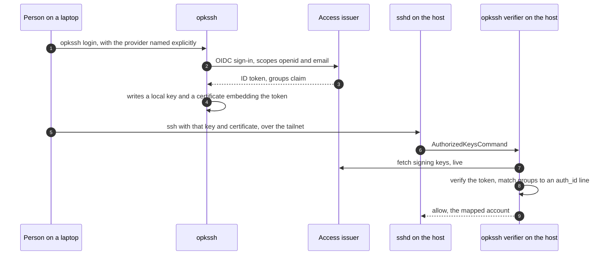

# People: sign-in, credentials, SSH and reach

A person proves who they are **once**, to one issuer, and everything else is
derived from that proof: short-lived credentials for the systems they may use,
minted on demand, with nothing stored. This page covers that sign-in, the
`accessctl` client, the two SSH mechanisms (a CA in OpenBAO, and opkssh), and
how a laptop reaches the network.

The issuer is [access-roster](https://github.com/truvity/access-roster): an OIDC
issuer whose tokens carry a `groups` claim. OpenBAO is a *relying party* of it,
never the other way round
([integrations/access-roster.md](../integrations/access-roster.md) is the contract
end to end). Any issuer that meets that contract works the same way.

## Sign-in

| Piece | What it does | Rule |
|---|---|---|
| the **issuer** | signs people in (or trusts a directory that does), signs tokens | one issuer for people; a token's `groups` decide what it may be exchanged for |
| a **client row** per application | the OIDC client an application (or the gateway) signs in as | one client per application, so the issuer's per-client `requires` gates each; confidential clients' secrets travel through the secret plane, never a laptop |
| a **public client for each CLI** | the client a command-line tool signs in as | its own row: public, loopback redirect. A CLI cannot reuse the UI's confidential row |
| **token exchange** (RFC 8693) | trades a sign-in token for a token for *another audience* | an audience is only issued to a person whose groups the client row requires |

**A CLI needs its own client.** For a public client the issuer follows RFC 8252
and matches a loopback redirect on **path, ignoring the port**, which is what makes
"whatever port the tool was given" declarable. If the issuer answers that the
`redirect_uri` is missing from the client configuration, look at the client id in
the URL the tool opened: a browser client's id in a native tool's request means no
CLI client was declared, and the refusal is correct.

**Sessions have an absolute limit.** A sign-in lives at most 24 hours regardless of
refresh, and every credential minted from it is shorter. An SSH provider entry and a
signing-key overlap are set against that bound (below).

**The exchange has one hole to keep closed.** A laptop's sign-in must be presented
to the exchange as an `access_token`, and the issuer must accept its *own* token as
a subject only when it is an access token, recorded, presented by the client that
holds it, for a person, in a live session. An issuer that accepted any token it had
signed would let a holder of any ID token (a console, a proxy, an API server) mint
credentials for other audiences.

**Groups are scoped per audience.** A token carries only the groups the audience's
client row asks for, so a system sees the groups relevant to it and nothing that
identifies the person's other memberships.

**Signing algorithms are per audience.** The installation default is ES384. Some
relying parties verify only RS256 (a managed Kubernetes API server's OIDC
integration is inferred to be RS256-only, **to be confirmed**; some promotion and
delivery tools verify RS256 only; opkssh's verifier accepts RS256, PS256, ES256 and
EdDSA and refuses ES384). Those audiences carry a per-audience `signing_alg`
override; every mount states `jwt_supported_algs` explicitly
([decision 0004](../decisions/0004-jwt-oidc-mounts-state-supported-signing-algorithms.md)).
Never flip the default before the pins for those audiences are in. Key rotation
keeps a retired key in the JWKS **longer than the longest credential** minted from
it: a 25-hour overlap for a 24-hour SSH provider entry.

## `accessctl`

`accessctl` is the client. Every command signs in (or reuses a cached, 0600
session), exchanges, and then either calls the system directly or runs the real
tool with credentials in its environment. Nothing is stored beyond a cache and no
long-lived key exists on a laptop.

| Command | What it does | Result |
|---|---|---|
| `accessctl login` | signs in; also fetches every SSH host CA it is configured to trust into a file it owns | a cached session |
| `accessctl bao <args>` | logs in to OpenBAO's JWT mount at the target namespace, then runs the real `bao` with your arguments | OpenBAO's own CLI, unchanged |
| `accessctl psql` / `accessctl pg -- <cmd>` | mints a `db-client` certificate, runs `psql` (or a command) with libpq's environment | a database session ([databases.md](databases.md#people)) |
| `accessctl kube-token` | exchanges for a Kubernetes API audience | a token for `kubectl` |
| `accessctl aws` | exchanges for an AWS federation audience | temporary AWS credentials |
| `accessctl r2` | wraps the storage broker CLI | a temporary, bucket-scoped storage credential |
| `accessctl ssh known-hosts` | writes the host CAs it trusts as `@cert-authority` lines | a known-hosts file it owns |

`--as <role>` and `--target <address>` for `pg`/`psql` are **PLANNED**
([databases.md](databases.md#people)). A machine has the same commands with a
different subject: a CI job or a controller presents its own OIDC token (a
GitHub Actions token, a projected ServiceAccount token) and the issuer's grants
decide what it may be exchanged for. The issuer's exchange is the only way in:
no client presents a job's token directly to OpenBAO.

**What lives on the laptop.** A private key that the credential is *for* (the SSH
key, the database key) is generated **on the laptop** and never leaves it: OpenBAO
roles offer `sign` only, never `issue`; opkssh puts the person's own key into the
certificate. What crosses the wire is a CSR or a public key. The cache under the
client's config directory holds only short-lived tokens, mode 0600.

### OpenBAO itself

A person or a machine logs in to OpenBAO's **JWT mount** with the exchanged token.
The token's `groups` claim is mapped to **identity groups**, and identity groups
carry the policies; the role itself carries no policy. Logins, policies and groups
live at the **environment** namespace; mounts live at `<env>/<project>`
([decision 0001](../decisions/0001-namespaces-are-environment-project.md)). The web
UI is a separate OIDC door. One group admitted through two doors becomes two
identity groups (OpenBAO gives a group one alias), which the model handles
([model.md](../model.md#groups-and-doors)). Operators are a group in the issuer;
the bootstrap door is declared for review and never applied by the apply itself.

## SSH

SSH has three populations, and one design fits none of them well, so each gets
what fits it. A person at a keyboard, a machine acting on its own identity, and a
host proving it is the host the client thinks it is
([decision 0003](../decisions/0003-ssh-people-external-machines-and-hosts-on-our-cas.md)).

| Who | Mechanism | CA? | Lifetime |
|---|---|---|---|
| a **person** | **opkssh**: an OpenID Connect ID token, wrapped as an SSH certificate extension and verified straight into `sshd` | none | bounded by the issuer's session, at most 24 hours |
| a **machine** (a CI job, a controller) | a certificate signed by the **SSH user CA** in OpenBAO | yes: the environment's user CA | minutes to hours, capped by the role |
| a **host** | a certificate signed by the **SSH host CA**, a separate key on a separate mount | yes: the environment's host CA | at most 30 days, renewed daily |

### People: opkssh



- **No CA, no broker.** The token is the credential. There is nothing to revoke or
  distribute; a host needs only outbound reach to the issuer's discovery document
  and signing keys (a live dependency on every verification).
- **Keys never leave the laptop.** opkssh generates the key locally; the issuer sees
  only an OIDC sign-in.
- **A dedicated public client** with the loopback redirects opkssh's browser flow uses
  and a per-audience `signing_alg` of RS256 or ES256 (see above).
- **Per host, two files:** `providers` (issuer, client, an expiration matching the
  issuer's session bound) and `auth_id` (which group maps to which account). The
  ladder (`user`, `operator`, `admin`) is **which lines were written on that host**;
  a group does not imply another unless the issuer's declared vocabulary computes it.
- **Choose accounts deliberately.** A group mapped to an account with passwordless
  privilege is that privilege, for everyone in the group. State it in the
  runbook of the host kind rather than discovering it.
- **The sign-in warning.** Name the provider explicitly (`--provider`) and treat a
  browser opening at a *different* identity provider as a stop: a stale client
  config can silently pick another default.

#### The colon-group limitation, and its workaround

opkssh parses its `oidc:groups:<value>` rule by splitting the whole argument on
**every** `:` and comparing only the *last* segment. A group named
`<env>:ssh:admin` is therefore matched as a group named literally `admin`: a
colon-named group can never match, and anyone holding a plain `admin` group would
be admitted. Quoting the value does not help.

**Workaround, live:** the issuer has a per-audience **`groups_delimiter`**. The
opkssh client row sets it to `.`, so opkssh tokens carry `<env>.ssh.admin`, and
every `auth_id` line uses the dot form. The issuer refuses to load a policy if two
groups would collide after the rewrite. The `requires` lists in the issuer's policy
stay in colon form, because that is the issuer-side name. **A new host or
environment that uses the colon spelling silently denies everyone.** The
troubleshooting kit: `opkssh inspect` on the certificate to compare the groups with
the host's `auth_id`; "too many authentication failures" means the agent offered
other keys first (use `IdentitiesOnly` with the key); "state does not compare" is a
stale sign-in callback on the old listener.

The upstream fix has been reported privately to the maintainers. **Remove the shim
once opkssh releases it:** first the host `auth_id` lines, then the client row, then
the issuer option. Until then it is a documented, temporary interop.

### Machines: the SSH user CA

A CI job or controller signs in through the issuer's exchange (a GitHub Actions or
ServiceAccount token, exchanged, then an OpenBAO login) and asks the environment's
user CA to sign the public key of the key it made. The certificate's key id is the
login's display name, so an `sshd` log line is read against the issuer's audit
trail by it.

- **`allowed_users` is spelled out**, never `*`, never root; extensions are no wider
  than needed.
- **`force-command`** on a role makes every certificate it signs carry exactly one
  command, for a restricted account that should never get a shell (a backup agent, a
  build daemon). The role's own configuration **cannot** make it unconditional: when a
  request supplies its own `critical_options`, OpenBAO uses the request's map *in
  place of* the role's default. The fix is a **policy-level denial** of the
  `critical_options` parameter on the grant, and the model refuses to apply a grant
  onto a force-command sign path without it
  ([safety.md](../safety.md#a-forced-command-that-a-caller-can-still-replace)).
- A host that trusts the user CA carries `TrustedUserCAKeys`; a host that does not
  need machine access carries no user-CA trust at all. **A host that only takes
  people through opkssh should trust no SSH user CA**: an unused second root path is
  a liability the day any role on that mount signs for one of its accounts.

### Hosts: the SSH host CA

A host's certificate lets a client trust it with **one** `@cert-authority
<domains> <key>` line instead of pinning each host's key and updating that pin every
time a host is replaced. `accessctl ssh known-hosts` writes those lines, one per
environment, each scoped to that environment's host pattern, to a file the client
owns (never the user's own `known_hosts`).

- A separate CA on a mount of its own: a key clients trust for hosts must never also
  be a key `sshd` trusts for users.
- A host role signs literal host names -- no wildcard, no template -- and a
  certificate lives at most 30 days, with daily renewal.
- A host proves itself to get a certificate the way any workload does: a projected
  ServiceAccount token for a host running as a pod, or a cloud identity for a host
  that is not. **The cloud-identity route exists as a renewer
  (`cmd/openbao-hostcert`, [hostcert-renew.md](../hostcert-renew.md)); pods are the
  fully-built path.** A host that is neither has no host-certificate path.

### Revocation and audit

| Mechanism | Revocation | Audit |
|---|---|---|
| opkssh | remove the person from the group; their next sign-in yields no token, and an existing certificate ends with the session (at most 24 hours) | `sshd`'s own log (`LogLevel VERBOSE`); on a replaced host it is lost with the host |
| SSH user CA | short-lived certificates, no list; remove the group | the certificate's key id (the login's display name) in `sshd`'s log, joined to the issuer's and OpenBAO's audit device |
| SSH host CA | replace the host; the certificate ends within 30 days | the CA's signing events in OpenBAO's audit stream |
| database certificate | 1-hour life; remove the group | the session records the certificate identity (`system_user`) |

OpenBAO's audit device writes to a durable, ideally write-once, stream; that
stream, not a log line, is what proves a completed action.

## Network reach

**Nothing private is on the public internet.** People reach private names over a
**tailnet**:

- a **subnet router** advertises the Service CIDR (a small deployment per cluster,
  [truvity/tailscale](https://github.com/truvity/tailscale)) and, where an
  instance-based router is used, the VPC CIDR;
- **split DNS** points the private zone at the estate's own resolver, so
  `<name>.<zone>` resolves for a tailnet client and nothing else does;
- the tailnet **policy is data**: which group reaches which CIDR and port. SSH port 22
  is reachable only through it, with no security-group port.

Split DNS resolves the **private zone**, not every cluster's internal domain. An
in-cluster name (`<svc>.<ns>.svc.<cluster-domain>`) may not resolve from a laptop, and
its certificate names *only* that form. So a client that must verify the name but
cannot resolve it dials an address and verifies the name separately:

```
host=<svc>.<ns>.svc.<cluster-domain> hostaddr=<ClusterIP or router-reachable IP>
```

`accessctl pg --target` will do this (**PLANNED**). It is `verify-full`, not
`require`, and not a weaker mode "because it is a tunnel".

## Where this page ends

Application sign-in in a browser is the gateway's engine
([servers-and-edge.md](servers-and-edge.md#sign-in-at-the-gateway)). A workload calling
a workload is [workload-identity.md](workload-identity.md). The mechanism behind every
credential above is the OpenBAO model: [model.md](../model.md).
