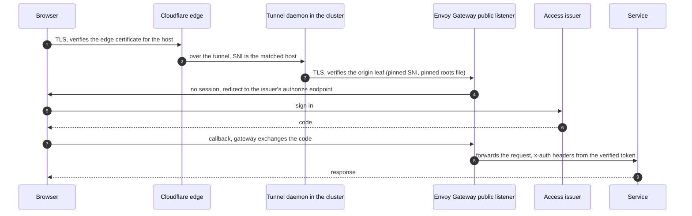

# Servers, hostnames and the edge

How a client decides it reached the right machine, and how a request gets
from a browser, through the edge, to a service. Most of this is *not*
OpenBAO: OpenBAO issues the certificates; Envoy Gateway, Cloudflare, the
tunnel daemon, DNS and the tailnet decide where they are presented and who
checks them.

## Names

**A server is identified by a DNS name, and a client checks the name.**
`verify-full` (verify the chain *and* the host name) is the baseline for
every TLS client: HTTP, PostgreSQL, NATS, OpenBAO, everything. A client that
only verifies the chain accepts any certificate the trusted CA ever issued.

| Where the name lives | Shape | Issued from | Reached from |
|---|---|---|---|
| the environment's private zone | `<name>.<zone>` where `<zone>` is the environment's private zone (`<env>.example.internal` in these docs) | the private chain, role `private` | the tailnet, over split DNS |
| in-cluster services | `<service>.<namespace>.svc.<cluster-domain>` and **only** that shape | the private chain, role `service` | pods in the cluster |
| the public host | `<host>.<public-zone>` (`app.example.org` in these docs) | Cloudflare's edge certificate to browsers; the origin chain behind the tunnel | the public internet |

Three rules that keep names honest:

- **One exact record per private name, never a wildcard.** A name that
  resolves must be one the catalogue declares. The writer refuses a wildcard
  and any name outside the cluster's own private zone.
- **Short in-cluster forms are not offered.** `<service>.<namespace>.svc` and a
  bare service name fall outside the private intermediate's constraint and are
  denied by the approver. A client must dial the fully qualified name to verify
  it. This bites clients that were written against the short form.
- **The zone is authored once, in the catalogue.** The PKI contract never
  authors a zone, so it can never be a second owner of one; role patterns say
  `{zone}` and the caller substitutes it.

A person's laptop reaching an in-cluster name is a special case. Not every
cluster domain resolves off-cluster, so a client that must verify the in-cluster
name but dial an address uses the two separately: libpq `host=<fqdn>
hostaddr=<ip>` (the name is verified, the address is dialled). See
[people.md](people.md#network-reach).

## The exposures

An **exposure** is one way in. Each has its own Gateway, its own data plane and
its own certificate source:

| Exposure | Entry | Zone | Listener certificate | Who is let in |
|---|---|---|---|---|
| **public** | a Cloudflare tunnel | `<env>.<public-zone>` and flat canonical names | the **origin chain**, role `origin`; the tunnel daemon verifies it | per route, from the access-issuer client row |
| **private** | a pinned ClusterIP, reached over the tailnet; an internal load balancer only where another cluster must reach it | `<env>.<private-zone>` | the **private chain**, role `private` | per route, same engines |
| **customer** (PLANNED) | a tunnel, its own gateway class | customer zones | as public | the product issuer |
| **machine** (PLANNED) | an internal load balancer, its own port | private zone | `private` leaf **plus client certificates** (`clientValidation`) | mutual TLS is the authentication |

A **group** is one project's claim on an exposure: the hostnames it serves and
the namespaces whose routes may attach. It is a `ListenerSet` parented to the
exposure's Gateway, with one listener and one Certificate per domain. The
catalogue -- one file listing exposures, clusters, groups, domains and route
namespaces -- is the source of every derived thing: the tunnel's ingress
rules, the DNS records, the listener certificates, the origin role's host list,
the fleet's network policy egress. `allowedListeners` is the wall: a project
cannot open a listener by creating an object in a namespace it controls.

Data planes are **split by default**: each exposure has its own Envoy
deployment and Service, so a crash or a bad config stays inside one exposure and
public traffic never reaches the pods that serve the private listeners. Moving
an exposure to its own class is a selector change on a Service with a pinned
ClusterIP (`spec.clusterIP` is immutable), a window of seconds, not a new
address.

## Trust flows: edge, then origin, then service

Three separate certificate checks, three separate anchors:

1. **Browser to edge.** Cloudflare's own certificate. The browser's trust store
   decides; nothing here is ours. Cloudflare holds a certificate per host
   (advanced certificate packs; see below), and Total TLS per zone.
2. **Tunnel daemon to origin.** The daemon dials the gateway and verifies the
   origin leaf against `originRequest.caPool` (a pinned file, the committed roots
   of every trusted generation) and pins the **origin server name** per
   hostname. The daemon does not trust the private root, and nothing else trusts
   the origin chain. Browsers never see the origin chain.
3. **Gateway to service.** Today the gateway terminates TLS and forwards to a
   ClusterIP Service. Where a backend must be re-encrypted, the gateway supports
   `BackendTLSPolicy` plus a client certificate of its own (role `gateway`);
   the option is adopted, and used only where a backend asks. A
   gateway-fronted component stays `permissive` for workload identity for the
   reason in [workload-identity.md](workload-identity.md#modes-and-levels).
   Giving the gateway pods their own SPIFFE identity so that the gateway-to-app
   hop is authenticated is **not decided**.

**The tunnel decides the listener.** The daemon sends the matched rule's
hostname as the origin SNI, so an exact-host group needs its exact tunnel rule
*before* its routes leave a wildcard listener; routes sit on both parents until
that rule is live. A single flip either way is a 404. A ClientTrafficPolicy that
selects the parent Gateway also covers its ListenerSet's listeners, so a TLS
floor set once on the exposure applies to every group.

### Where TLS floors live

Two layers terminate client TLS: Cloudflare's edge (the zone's minimum TLS
version) and Envoy (direct tailnet traffic). The Envoy floor is a
`ClientTrafficPolicy` per gateway-bearing namespace, opt-out by an explicit
label; the edge floor is a zone setting owned by the zone component.

## Sign-in at the gateway

A route can carry a **`proxy.engine: envoy`** client row in the access issuer's
policy. It renders a `SecurityPolicy` on the application's own route with:

- `oidc`: explicit authorize, token and end-session endpoints (so the controller
  needs no discovery egress), refresh enabled, the access and ID tokens forwarded
  (an encrypted cookie is the session; the forwarded ID token is a header);
- `jwt`: a provider reading that header from the issuer's JWKS, setting the
  user and e-mail headers the application trusts;
- `authorization` on the `groups` claim.

**One client per application.** A shared single-sign-on proxy holds one client
id, so the issuer's per-client `requires` could no longer gate each application.
Single sign-on comes from the *issuer's* session instead. The client secret still
travels through the secret plane (External Secrets from OpenBAO) into the
application's namespace.

**Traps that cost days, all silent:**

1. **Envoy Gateway names a derived cluster after host and port alone.** The OIDC
   token endpoint and the JWT `remoteJWKS.uri` on the same issuer host collapse
   onto one cluster, and settings on the loser (`tcpKeepalive`, cluster-scoped
   blocks) are dropped while the policy still reports `Accepted` and the rendered
   YAML shows the block. Tell: `upstream_connection_options: {}` on that cluster.
   State the same backend settings on both sides, or give one side its own
   backend.
2. **The refresh endpoint reads the token twice.** Envoy's OIDC filter refreshes
   per request across replicas that share nothing, so one page's concurrent calls
   present one spent, rotated token several times in a second. A grace window
   must cover *both* reads, and a short `ttl_cap` multiplies the races.
3. **Path residue from a proxy era.** The gateway serves `logout` and no sign-in
   path at all: it gates every request, so loading the application is what
   redirects. Probing these paths unauthenticated proves nothing (everything
   gated answers 302).
4. **A swap needs a gap-free order.** Land the new policy first (it reports
   `Conflicted` while the old one wins on the same route), verify, then retire the
   old exposure in a separate change. Applications sync in no fixed order.

A browser-only application uses this engine. A **public client** (a CLI, a
console that runs its own flow) has no proxy block: a CLI needs a client row of
its own, public, `loopback: true`, or the issuer answers that the redirect is
missing. See [people.md](people.md#sign-in).

## Cloudflare

| Piece | What it does | Rule |
|---|---|---|
| **edge certificates** | what a browser sees | one advanced certificate pack **per host**, plus Total TLS per zone |
| **tunnel** | a remotely managed tunnel per (cluster, account); one daemon install per tunnel | the tunnel's ingress rules and DNS records come from the catalogue, exact rule before wildcard |
| **origin certificates** | not Cloudflare's: the origin chain above | the daemon verifies against the pinned roots file |
| **API tokens** | account-owned child tokens per stack | a **root token** that holds *only* the Account-API-Tokens permission mints the children (`edge`: tunnels, DNS, zone settings, certificates; `status`: tunnel plus DNS; `r2-admin`; one per bucket) |
| **R2 access** | short-lived, bucket-scoped credentials | a broker verifies an OIDC token and maps **group only** to bucket, prefixes and permission |

**Per-host packs.** A certificate pack's host list is *immutable*: editing it
makes the state delete and re-create the pack. Deletion is instant; issuance
(validation, edge deployment) is asynchronous and takes 10 to 15 minutes, and
every host the old pack covered serves a TLS error in between. Pulumi reports
"0 changes" while packs are still pending, so a refresh does not repair it and
may replace a pack mid-issuance. **The per-host shape makes adding a host
additive**: a new host is a new pack and touches no existing one, at the cost of
one pack per host. If a pack must change, create the new packs, wait for
`status: active`, then remove the old one -- two applies.

**Least-privilege tokens, minted by a root token.** A user token cannot hold the
permission to create account tokens (Cloudflare refuses), so the root token is an
account-owned token that holds only that. It lives in the secret plane at an
operators-only path; the children are minted into a path the consuming stacks
read. A child never gets the ability to mint tokens. Permission-group names on the
API use "Write" where a dashboard says "Edit", and there is no separate
"cache rules" group (cache settings cover them). A rotation is a changed
`rotation` string in the catalogue, not an expiry. Editing a token's permissions
may not propagate until the token is rolled.

**R2 credentials** do not go through OpenBAO's PKI or through the access
issuer: a broker in the Cloudflare component verifies a plain OIDC token, maps a
**group** to `bucket + prefixes + permission`, holds the parent key, and mints a
temporary credential. Rationale: the issuer mints third-party credentials only for
systems whose membership it governs; storage minting is not one, and keeping the
parent key in its own service isolates it better than keeping it in the issuer.

## OpenBAO's own endpoint

OpenBAO terminates its **own** TLS. On the cluster that hosts it, the private
exposure's gateway carries a **TLS-passthrough** listener that routes the
OpenBAO name by SNI to a ClusterIP Service, so a cross-cluster client reaches it
through the cluster's one shared internal load balancer, and OpenBAO still
presents its own certificate. The serving certificate is issued *by* OpenBAO's
hierarchy through cert-manager, with a sidecar that reloads it, and the break-glass
leaf for the day it cannot be ([hierarchy.md](hierarchy.md#the-break-glass-leaf)).
A client verifies the one name the certificate is certain to carry
(`BAO_TLS_SERVER_NAME`) rather than the address it dialled.

## Reaching private names: the tailnet

People reach the private exposure over a tailnet: a subnet router advertises the
cluster's Service CIDR (and the VPC CIDR where a cloud router is used), and split
DNS points the private zone at a resolver of the estate's own. **There is no
public SSH and no public private-exposure address.** The tailnet policy states who
reaches which CIDR and port as data. See [people.md](people.md#network-reach) and
[truvity/tailscale](https://github.com/truvity/tailscale).

## What is deliberately absent

- **No service mesh.** Three hops, three mechanisms (client to gateway, gateway to
  backend, service to service), each in the application or the gateway, sharing
  the same PKI. See [decisions.md](decisions.md#t-11-no-mesh-mutual-tls-at-application-level).
- **No second PKI kept aside** for the edge or for OpenBAO's own certificate.
- **No wildcard private DNS record**, no wildcard certificate outside the origin
  role's declared group domains.
